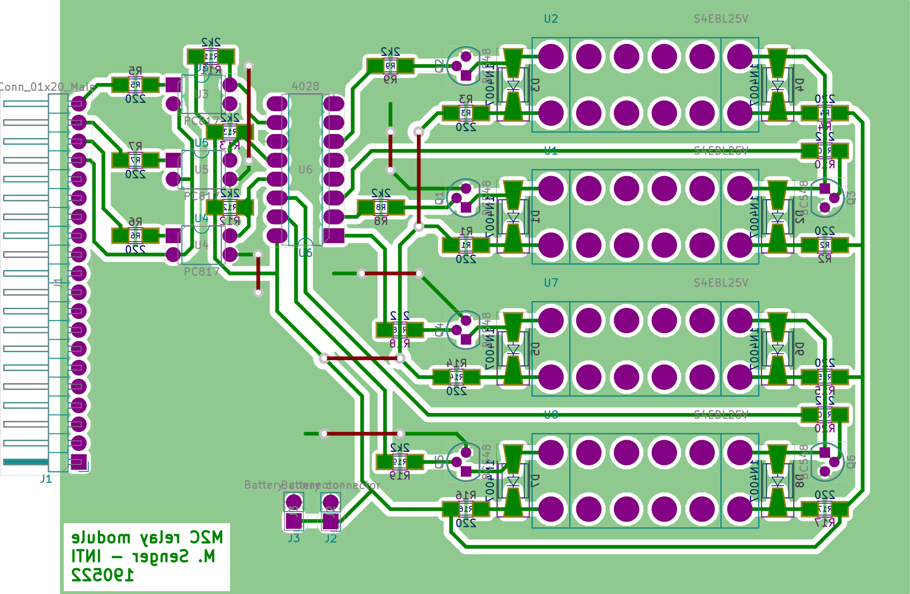

# voltage-scanner-pcb-m2c

[KiCad](http://kicad-pcb.org/) project for the M2C board. This board implements two independent channels, to connect up to two zeners. The schematic of this board can be found in [this link](export/Scanner-zeners.pdf). Below is the layout.

